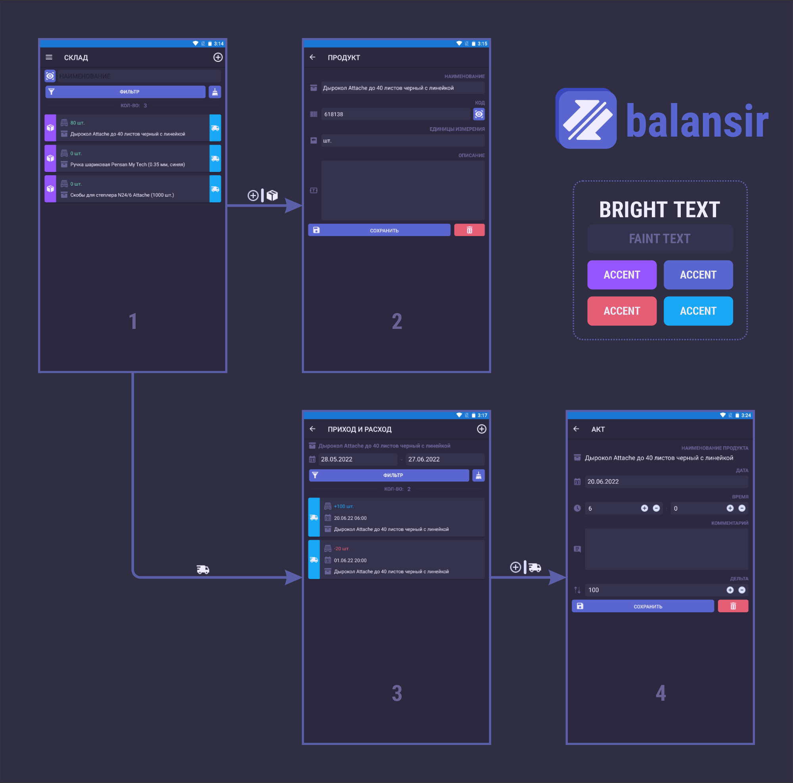

*Мобильное приложение для складского учета. Основное назначение: регистрация продукции, фиксирование актов прихода\расхода и расчет баланса для каждой позиции.*

### КОМПОНЕНТЫ
- **Framework:** [Xamarin.Forms](https://docs.microsoft.com/en-us/xamarin/get-started/what-is-xamarin-forms)
- **Graphics:** [icons8](https://icons8.com/)
- **Database:** [SQLite](https://www.sqlite.org/)
- **ORM:** [SQLite-net](https://github.com/praeclarum/sqlite-net)
- **Barcode Scan:** [ZXing.Net](https://github.com/micjahn/ZXing.Net)

